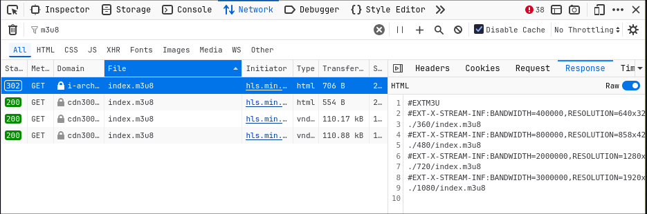

# Blob Downloader

A lightweight Python application designed to download video or audio streams from streaming platforms using the blob format.
Ideal for saving media content for offline use or further processing.

> [!NOTE]
> Currently, the script is functional for manual use but lacks some features I plan to add in the future. Potential improvements include:
>
> - **Automatic URL Decoding:** Automatically decode URLs and determine the correct order of segments based solely on the URL format.
> - **Handling Separated Sources:** Support cases where video and audio sources are separate and need to be combined into a single file.
>
> These enhancements could make it a viable candidate for a **web extension** in the future.

## ✍️ Use cases

Suppose you are on a webpage with a video playing. When inspecting the element, you find a video source like this:

```html
<video crossorigin="" aria-hidden="true" preload="" src="blob:https://test.autoembed.cc/fd1755d5-24b2-4619-9567-c6a8db76d65f" playsinline="">
    <source src="https://i-arch-400.lethe399key.com/stream2/i-arch-400/13610de3eb7617013a990e08246cd748/MJTMsp1RshGTygnMNRUR2N2MSlnWXZEdMNDZzQWe5MDZzMmdZJTO1R2RWVHZDljekhkSsl1VwYnWtx2cihVT290Val2TEZkaOp3ZzklMG1mTqdmMZdVUykleGh2TEFFNOpHaq1keG1mTHVVP:1768313435:193.233.230.41:a391c0659b4a5ae6142e7cb40d86b91f36ada61a75f799ec68231a82c98e27a8/index.m3u8" type="application/x-mpegurl" data-vds="">
</video>
```

The URL looks like `blob:https://test.autoembed.cc/fd1755d5-24b2-4619-9567-c6a8db76d65f`. If you try to access this URL in another tab, it leads nowhere.

Instead, go to the **Network tab** in the developer tools and search for `m3u8`.



You will find a request like:

```text
https://i-arch-400.lethe399key.com/stream2/i-arch-400/13610de3eb7617013a990e08246cd748/MJTMsp1RshGTygnMNRUR2N2MSlnWXZEdMNDZzQWe5MDZzMmdZJTO1R2RWVHZDljekhkSsl1VwYnWtx2cihVT290Val2TEZkaOp3ZzklMG1mTqdmMZdVUykleGh2TEFFNOpHaq1keG1mTHVVP:1768313435:193.233.230.41:a391c0659b4a5ae6142e7cb40d86b91f36ada61a75f799ec68231a82c98e27a8/index.m3u8
```

The response will be a `.m3u8` file listing video streams in different resolutions:

```text
#EXTM3U
#EXT-X-STREAM-INF:BANDWIDTH=400000,RESOLUTION=640x320
./360/index.m3u8
#EXT-X-STREAM-INF:BANDWIDTH=800000,RESOLUTION=858x428
./480/index.m3u8
#EXT-X-STREAM-INF:BANDWIDTH=2000000,RESOLUTION=1280x640
./720/index.m3u8
#EXT-X-STREAM-INF:BANDWIDTH=3000000,RESOLUTION=1920x960
./1080/index.m3u8
```

> [!WARNING]
> The URLs listed below each stream in the `.m3u8` file can be **relative** (based on the URL used to fetch the file) or **absolute**. Ensure you resolve relative URLs correctly before fetching the segments.

To get the highest resolution, fetch the URL:

```text
https://cdn30091.lethe399key.com/stream2/i-arch-400/13610de3eb7617013a990e08246cd748/MJTMsp1RshGTygnMNRUR2N2MSlnWXZEdMNDZzQWe5MDZzMmdZJTO1R2RWVHZDljekhkSsl1VwYnWtx2cihVT290Val2TEZkaOp3ZzklMG1mTqdmMZdVUykleGh2TEFFNOpHaq1keG1mTHVVP:1768313435:193.233.230.41:a391c0659b4a5ae6142e7cb40d86b91f36ada61a75f799ec68231a82c98e27a8/1080/index.m3u8
```

The response will be another `.m3u8` file listing all the video segments:

```text
#EXTM3U
#EXT-X-VERSION:3
#EXT-X-TARGETDURATION:6
#EXT-X-MEDIA-SEQUENCE:0
#EXT-X-PLAYLIST-TYPE:VOD
#EXTINF:6.006000,
https://i-arch-400.lethe399key.com/vod/9fb81c787caf686ad6c1a84878c31f4e/1080/segment0.ts?md5=hlZEo1py5lhReC83-oaUnA&expires=1768320696
#EXTINF:4.004000,
https://i-arch-400.lethe399key.com/vod/9fb81c787caf686ad6c1a84878c31f4e/1080/segment1.ts?md5=HbK4kAvh9NohDBxbk-lhTg&expires=1768320696
#EXTINF:6.006000,
https://i-arch-400.lethe399key.com/vod/9fb81c787caf686ad6c1a84878c31f4e/1080/segment2.ts?md5=HFvr3vZCWJqWT40rTAhnCQ&expires=1768320696
...
```

By fetching all these segment URLs, downloading the raw binary data, and concatenating them in the correct order (e.g., `segment0.ts`, `segment1.ts`, etc.), you can create a single binary file (`tmp_file.bin`).

> [!CAUTION]
> The order of segments is not always straightforward. In some cases, the filename or number indicating the segment's order may be **encoded in Base64** as part of the URL. You may need to decode the URL to determine the correct sequence.

Finally, use `ffmpeg` to convert the binary file to an `.mp4` file:

```bash
ffmpeg -i temp.ts -c copy output.mp4
```

## 🖱️ Usage

### 📥 Setup Instructions

**Prerequisite:** Ensure [`ffmpeg`](https://ffmpeg.org/) is installed on your system.

1. Clone the repository and navigate into the project directory:
   ```bash
   git clone https://github.com/leoraclet/blob-downloader
   cd blob-downloader
   ```

2. Install the required dependencies:
   ```bash
   uv sync
   ```

### 🚀 Running the Program

To start the program and view available options, use:

```bash
uv run main.py --help
```

## 📜 License

This project is licensed under the MIT License - see the [LICENSE](LICENSE) file for details.
